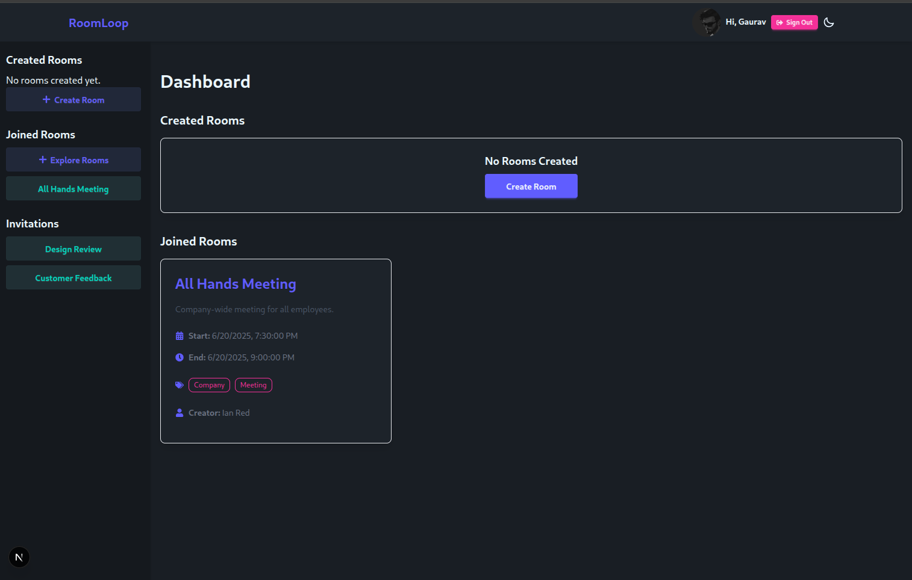
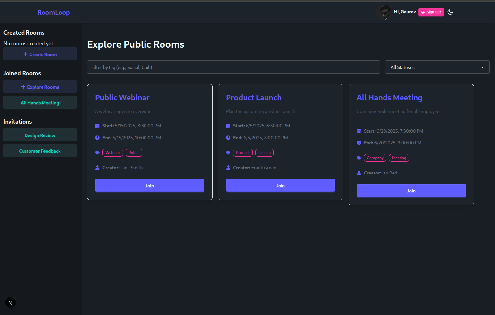
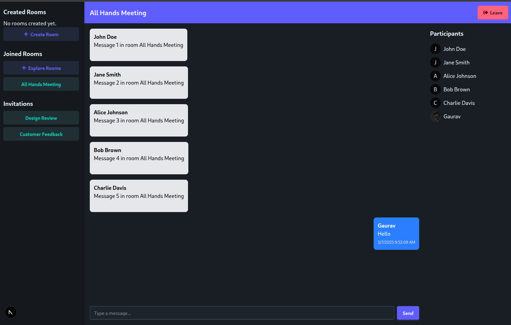
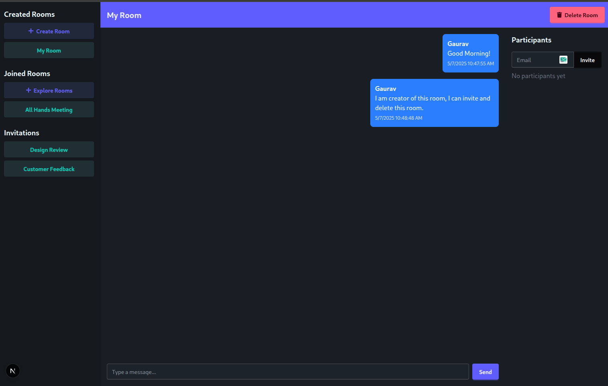
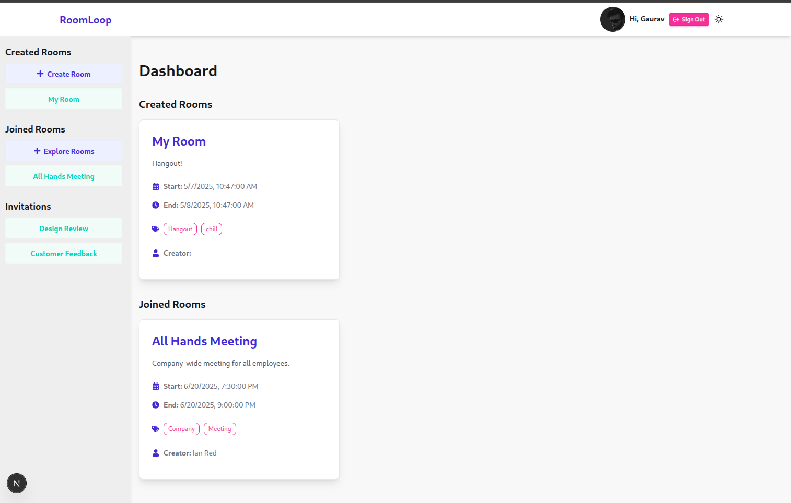

# RoomLoop

RoomLoop is a collaborative platform for managing and participating in rooms for various purposes such as meetings, webinars, and social gatherings. It supports private and public rooms, real-time messaging, and user invitations.

## Features

### General
- **Room Management**: Create, join, and explore rooms.
- **Room Types**: Support for private and public rooms.

### Private Rooms
- Invite users by username or email.
- Restricted access to invited participants only.

### Public Rooms
- Anyone can view and join public rooms from the explore page.

### Messaging
- Real-time messaging within rooms.
- Emoji reactions to messages.

### Invitations
- Invitations appear in the dashboard for easy access.

### Dashboard
- View created, joined, and public rooms.
- Filter rooms by tags or status.

---

## Tech Stack

### Backend
- **Node.js**: JavaScript runtime for building the server-side logic.
- **Next.js**: Framework for server-side rendering and API routes.
- **Prisma**: ORM for database management and queries.
- **PostgreSQL**: Relational database for storing application data.

### Frontend
- **React**: Library for building user interfaces.
- **Tailwind CSS**: Utility-first CSS framework for styling.
- **DaisyUI**: Tailwind CSS components for UI design.

### Libraries
- **React Icons**: Icon library for adding icons to the UI.
- **Better Auth**: Authentication library for managing user sessions.
- **TypeScript**: Strongly typed programming language for better code quality.

---

## Installation

### Prerequisites
- Node.js (v16+)
- PostgreSQL database

### Steps
1. Clone the repository:
   ```bash
   git clone https://github.com/b9aurav/roomloop.git
   cd roomloop
   ```

2. Install Dependency:
    ```bash
    npm install
    ```

3. Set up the database:
    * Create a .env file in the root directory with the following content and make sure to set values:
    ```bash
    cp .env.example .env
    ```

4. Push prisma schema to database:
    ```bash
    npx prisma db push
    ```

5. Seed database with dummy data:
    ```bash
    npx prisma db seed
    ```
6. Start development server:
    ```bash
    npm run dev
    ```





